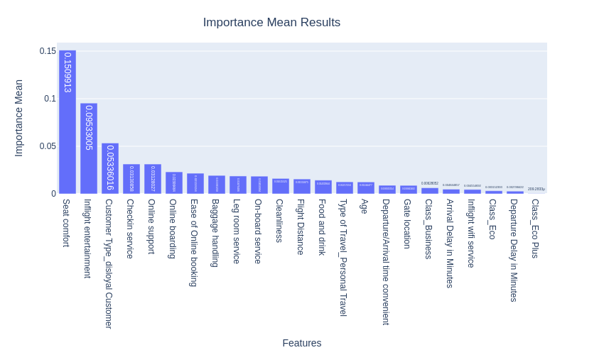

### Project Title
Airline Passenger Satisfaction - What factors will enhance airline passenger satisfaction? 

**Author** 
Ben Harosh

### Rationale
In the competitive landscape of the airline industry, customer satisfaction is a key for customer happiness and retention. Identifying features that can contribute to increasing customer satisfaction, can be crucial to airlines in terms of keeping existing customers, expanding customer base and increasing revenue as a consequence.

### Research Question
Find the factors that contribute to airline customer satisfaction and tailor their services accordingly to enhance the overall customer experience.

### Data Sources
Kaggle data Source “Airline Customer Satisfaction”:
https://www.kaggle.com/datasets/raminhuseyn/airline-customer-satisfaction/data

### Data Description

The dataset comprises 129,880 records, with a small number (~300) of missing values. It includes 21 features, encompassing the target variable `satisfaction``. Seven features were collected by the airline, such as customer age, flight distance, arrival and departure delays (numerical), as well as customer type, type of travel, and class of travel (categorical features). The remaining 13 features consist of customer survey data, covering in-flight and pre-flight services, features on the plane, and ground services. Additionally, there are customer survey features that were collected regarding the booking process.

Feature list:

|Column name	                  | Description                                                                |
|:------------------------------- |:-------------------------------------------------------------------------- |   
|Satisfaction	                  |Indicates the satisfaction level of the customer.                           |
|Customer Type	                  |Type of customer: 'Loyal Customer' or 'Disloyal Customer’.                  |
|Age	                          |Age of the customer.                                                        |
|Type of Travel	                  |Purpose of the travel: 'Business travel' or 'Personal Travel’.              |
|Class	                          |Class of travel: 'Business', 'Eco', or 'Eco Plus’.                          |
|Flight Distance	              |The distance of the flight in kilometres                                    |
|Seat comfort	                  |Rating of seat comfort provided during the flight (0:Not Applicable;1-5).   |
|Departure/Arrival time convenient|	Rating of the convenience of departure/arrival time (0:Not Applicable;1-5).|
|Food and drink	Rating            |of food and drink quality provided during the flight (0:Not Applicable;1-5).|
|Gate location	Rating            |of gate location convenience (0:Not Applicable;1-5).                        |
|Inflight wifi service            |Rating of inflight wifi service satisfaction (0:Not Applicable;1-5).        |
|Inflight entertainment           |Rating of inflight entertainment satisfaction (0:Not Applicable;1-5).       |
|Online support	                  |Rating of online customer support satisfaction (0:Not Applicable;1-5).      |
|Ease of Online booking	          |Rating of ease of online booking satisfaction ((0:Not Applicable;1-5).      |
|On-board service	              |Rating of on-board service satisfaction (0:Not Applicable;1-5).             |
|Leg room service	              |Rating of leg room service satisfaction (0:Not Applicable;1-5).             |
|Baggage handling	              |Rating of baggage handling satisfaction (0:Not Applicable;1-5).             |
|Checkin service	              |Rating of check-in service satisfaction (0:Not Applicable;1-5).             |
|Cleanliness	                  |Rating of cleanliness satisfaction (0:Not Applicable;1-5).                  |
|Online boarding	              |Rating of online boarding satisfaction (0:Not Applicable;1-5).              |
|Departure Delay in Minutes       |Total departure delay in minutes.                                           |
|Arrival Delay in Minutes	      |Total arrival delay in minutes.                                             |

### Methodology
Classification ML techniques to classify airline passenger satisfaction based on input features as flight delay times, flight distance and passenger type, combined with survey data collected from the airline passengers regarding their satisfactions (regarding food, seat comfort, etc.). We utilized simple classification models as 

### Summary of Findings

#### Data characteristics:
* The dataset seemed to be heavily focused on loyal customers - survey boasted over five times loyal customers than disloyal ones
* The dataset had customers who were on business travel more than double the number of those who were on personal travel
* The dataset maintained a balanced representation between economy and business class passengers. However, less than 10% of the airline passengers in the data set were flying economy plus
* Dataset was heavily focused on short to mid range flights with most of the data collected from passenger who traveled less than 4000 miles

#### Findings
* Air travelers who flew mid-range flights (1000-3000 miles) exhibited heightened levels of dissatisfaction compared to those on shorter or longer flights
* Departure and arrival delays exceeding 20 minutes were found to correlate with increased dissatisfaction levels, contrasting with shorter delays. There was almost no dissatisfaction difference between departure and arrival delays, which seems readonable since those are metrics that are highly correlated to begin with   
* Loyal customers demonstrated significantly higher satisfaction rates compared to disloyal air passengers, highlighting the importance of customer loyalty
* Customers flying Business Class reported a higher satisfaction rate 71%, surpassing the aggregated satisfaction average (55%)
* Customers traveling for personal reasons exhibited a lower satisfaction rate of 48% compared to the aggregated satisfaction average (55%)
* Disloyal customers reported a significantly lower satisfaction rate of 24% compared to the overall satisfaction average (55%)
* Seat comfort and In-flight Entertainment as the most influential features contributing to satisfaction
* Although rated high by many customers, cleanliness did not emerge as a significant factor to determine satisfaction 
* Customers on personal travel were found had higher satisfaction rates
Ease of pre-flight service as online booking and customer support played a role in enhancing customer satisfaction

#### Action Items
Working on translating this report to actionable item with the airline company, that will include:
  - Gather more data on disloyal customers in the future, in order to understand better the reason for their high diasstisfaction rate
  - Understand how to improve the experience of disloyal customers, maybe in ways of personal promotions and provide them with more features that contributed to higher satisfaction - as in-flight entertainment, in-flight food and drink and making sure that their pre-flight experience is positive (baggage handling and checkin services) 
  - Improve seat comfort as a way to increase customer satisfaction. Dat ahs shown that even customers who ranked it mediocore (3 out of 5) - had 2 times dissatisfaction rate compated to the overall rate
  - Enhance entertainment and WiFi services during flight as those contributed to overall higher satisfaction rates from customers who enjoyed them. We also noticed higher disatisfaction rate from customers who ranked their experience as mediocore negative with those services
  - Expand pre-flight online booking and support and solidify ground services (checkin and baggage handling) as a way to keep and increase satisfaction rates
  - Remove one out of the two customer survey questions regarding departure and arrival delay in minutes, since the answers on these were highly correlated (over 90%), which seems reasonale since both metrics are highly correlated to begin with
  - 

### Detailed Explanation of Results
#### Modeling
##### EDA modeling
Since the satisfaction and dissatisfaction classes are fairly balanced, and since we don't place significant emphasis on misclassification (recall or precision), but rather prioritize achieving accurate classification, we will focus on the accuracy metric for comparing the different classification models. With that in mind, the best classifier boasting the highest test classification accuracy is the RandomForestClassifier, achieving an accuracy of 95.60%. Following closely in second place is SVM with a test accuracy of 94.1%.

##### GridSearch Results
We focused on the 4 top performing models from EDA phase and ran GridSearchCV with different grid parameters in order to fine-tune the model training phase. Here are the results:

##### Neural Network Results
We constructed and trained two distinct types of neural networks to improve classification results. Initially, we developed a simple network comprising a single layer of hidden units (`NN_Simple` in the chart), followed by a more complex network featuring three layers of hidden units with added regularization (`NN_Complex` in the chart). Subsequently, we conducted a GridSearchCV to fine-tune the parameters of the more complex network (`NN_GridSearchCV` in the chart). Here are the outcomes:

We observed a notable improvement in the test accuracy of the best model, reaching `95.80%` (with a peak of `95.90%` during training on the test set). This enhancement was accomplished through the utilization of a more complex neural network model, coupled with fine-tuning via GridSearchCV. Overall, both the more complex neural network model and its fine-tuned counterpart outperformed the other classification models, albeit not by substantial margins. 

#### Feature Importance
We employed two distinct methods to extract the most important features from the trained models. Through our analysis, we identified the following features as playing the most significant role in this classification problem:
* Seat Comfort
* Inflight Entrtainment
* Ease of Online Booking
* On-Board Service
* Online Support
* Checkin Service

#### Next steps
* Follow up on the metioned action items
* Improve the Neural Network model and fine-tune it to have higher accuracy of predicting satisfaction
* Explore the `shap` library to better understand feature importance, alongsode the other feature importance methods I used above

### Outline of project
- [Link to capstone notebook](https://github.com/benharosh/berkeley_capstone/blob/master/capstone-final.ipynb)
- [Link to capstone notebook on GitHub Dev](https://github.dev/benharosh/berkeley_capstone/blob/master/capstone-final.ipynb)

#### Contact and Further Information
Please feel free to contact me for further discussion at `benharosh@gmail.com`