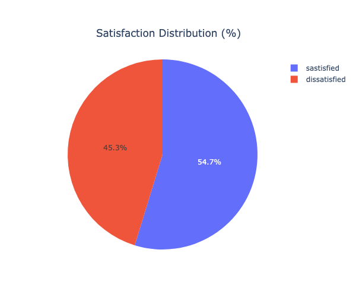
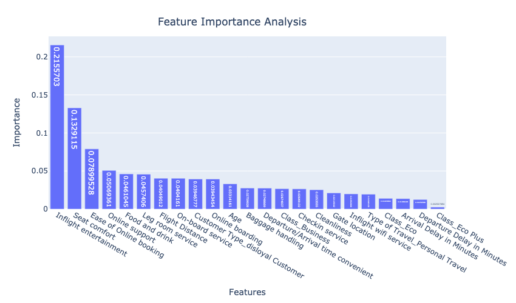

	

### Unlocking Airline Passenger Satisfaction: Key Factors for Enhanced Experience

**Author** 
Ben Harosh

### Executive summary

This capstone project delves into Machine Learning techniques to classify the satisfaction of airline passengers, aimed at determining whether customers will be satisfied or dissatisfied with the airline services. The dataset that was collected for this task encompasses three types of input data:

* Numerical data, including customer age, flight delays and distance flown
* Categorical data, such as customer loyalty, class of travel, and type of travel
* Customer survey data, comprising ratings provided by customers on the booking process, ground services, pre-flight and in-flight services

The project aims to discern which factors contribute to customer satisfaction and which may lead to dissatisfaction. By thoroughly analyzing the dataset, I will construct a predictive model capable of accurately predicting whether a given customer will be satisfied or dissatisfied with the airline service. Subsequently, I will conduct an in-depth analysis to identify the factors that have the greatest impact on customer satisfaction. Based on this analysis, recommendations will be provided to the airline on service areas and/or factors to prioritize in order to enhance customer satisfaction. Identifying these factors holds significant importance for the airline, as it can aid in customer retention, expansion of the customer base, and ultimately, revenue growth.

### Rationale
In the competitive landscape of the airline industry, customer satisfaction is a key for customer happiness and retention. Identifying features that can contribute to increasing customer satisfaction, can be crucial to airlines in terms of keeping existing customers, expanding customer base and increasing revenue as a consequence

### Research Question
Find the factors that contribute to airline customer satisfaction and tailor their services accordingly to enhance the overall customer experience

### Data Sources
Kaggle data source “Airline Customer Satisfaction” 
https://www.kaggle.com/datasets/raminhuseyn/airline-customer-satisfaction/data

### Data Description
The dataset comprises 129,880 records, with a small number (~300) of missing values. It includes 21 features, encompassing the target variable `satisfaction`. Seven features were collected by the airline, such as customer age, flight distance, arrival and departure delays (numerical), as well as customer type, type of travel, and class of travel (categorical features). The remaining 13 features consist of customer survey data, covering the customer ratings of the flight booking process, support services, ground services, pre-flight and in-flight services.

A full feature list can be found [here](./FEATURES.md)

#### Data characteristics:
* The dataset is slanted towards loyal customers - survey boasted over four times loyal customers (`81.69%`) than disloyal ones (`18.31%`)
* The dataset exhibits a skew towards customers traveling for business, comprising over double (`69%`) the number of those traveling for personal reasons (`31%`)
* The dataset maintains a balanced representation between economy (`44.84%`) and business class (`47.92%`) passengers. However, only `7.23%` of the airline passengers in the data set were flying economy plus
* The dataset primarily concentrates on customers who took short to mid-range flights, with the majority of data collected from those traveling less than 4000 miles. Specifically, approximately `67.42%` of customers flew distances ranging from 1000 to 3000 miles
* The target feature `satisfaction` is fairly balanced

    |Class	     | Percentage share |
    |:-----------|:---------------- |   
    |sastisfied  |54.733%           |
    |dissatisfied|45.267%           |

    

### Methodology
Exploratory Data Analysis:
* Data perp, cleaning nulls and duplicates check
* Analyzing the distribution of the target class
* Exploring numerical features: their distribution, outliers analysis and correlation matrix
* Exploring categorical features: their distribution, their breakdown vs the target variable 
* Exploring customer survey features: their distribution, their breakdown vs the target variable
* Exploring disloyal and loyal customers' survey features and their breakdown vs satisfaction/dissatisfaction

Classification Methods Used:
* Neural Networks
* Binary Random Forest Classifier
* Binary LogisticRegression Classifier
* Binary SVM Classifier
* Binary KNeighbors Classifier
* Binary DecisionTree Classifier
* Binary AdaBoost Classifier
* Binary DecisionTree Classifier
* Binary GradientBoosting Classifier

### Summary of Findings

#### Findings
* Air travelers who flew mid-range flights (1000-3000 miles) exhibited heightened levels of dissatisfaction compared to those on shorter or longer flights
* Departure and arrival delays exceeding 20 minutes were found to correlate with increased dissatisfaction levels, contrasting with shorter delays. There was almost no dissatisfaction difference between departure and arrival delays, which seems reasonable since those are metrics that are highly correlated (over `90%`)to begin with   
* Loyal customers demonstrated significantly higher satisfaction rates compared to disloyal air passengers, highlighting the importance of customer loyalty
* Customers flying Business Class reported a higher satisfaction rate of `71%`, surpassing the aggregated satisfaction average of `55%`
* Customers traveling for personal reasons exhibited a lower satisfaction rate of `48%` compared to the aggregated satisfaction average of `55%`
* Disloyal customers reported a significantly lower satisfaction rate of `24%` compared to the overall satisfaction average `55%`
* Seat comfort and In-flight Entertainment were the most influential features affecting satisfaction (when rated high) and dissatisfaction levels (when rated low)
* Although rated high by many customers, cleanliness did not emerge as a significant indicative factor to determine satisfaction/dissatisfaction
* Customers on personal travel were found had higher satisfaction rates
* Ease of pre-flight service as online booking and customer support played a role in enhancing customer satisfaction
* Customers aged between 40 and 63 exhibited a higher satisfaction percentage (`67%`) compared to the general average satisfaction rate (`55%`). Conversely, customers younger than 40 and those older than 63 expressed higher levels of dissatisfaction compared to the general average.

#### Recommendations
  - Given that disloyal customers exhibited a notably high dissatisfaction rate, albeit representing only `18.31%` of the dataset entries, it would be prudent to address this imbalance. Future surveys should focus on gathering more data from this specific group to gain deeper insights into the reasons behind their elevated dissatisfaction levels
  - Enhancing the experience for disloyal customers may involve tailored strategies such as personalized promotions and bolstering features known to drive satisfaction, such as `in-flight entertainment` and `food and drink` offerings. Moreover, ensuring a positive pre-flight experience, encompassing efficient `baggage handling` and streamlined `check-in` services, can further elevate satisfaction levels for this segment
  - Exploring avenues to enhance `seat comfort` could significantly elevate overall customer satisfaction levels. Analysis reveals that customers rating `seat comfort` as moderate (3 out of 5) exhibited twice the dissatisfaction rate compared to the overall average. Collecting data on plane models could further enrich insights, potentially unveiling correlations between specific aircraft models and seat comfort satisfaction. This information can inform decisions on prioritizing aircraft upgrades to better cater to customer preferences
  - Elevate the in-flight experience by enhancing `entertainment` and `WiFi` services, which have shown to positively influence overall satisfaction rates among passengers who enjoy them. Additionally, address the higher dissatisfaction rate observed among customers who rated their experience with these services as mediocre to negative, ensuring that these offerings meet or exceed expectations to uphold satisfaction levels
  - Broaden the scope of pre-flight services by enhancing `online booking` and `online support` functionalities. Additionally, bolster ground services such as `check-in` procedures and `baggage handling` to fortify overall customer satisfaction rates. Strengthening these areas not only fosters existing customer loyalty but also cultivates potential for increased satisfaction among passengers
  - Considering the high correlation (over 90%) between `Departure Delay in Minutes` and `Arrival Delay in Minutes`, and their redundant contribution to the analysis of customer satisfaction, it's sensible to remove one of these numerical features. Given their inherent logical relationship — flights departing late tend to arrive late — retaining both metrics doesn't significantly deepen the understanding of customer satisfaction from a data perspective

### Detailed Explanation of Results

#### Modeling
##### Deciding on a scoring metric
Given the fairly balanced distribution of satisfaction and dissatisfaction classes, and my prioritization of accurate classification over focusing on false-negatives or false-positives (recall or precision), I'll concentrate on the `accuracy` metric. Particularly, I'll assess the `test accuracy` against the dedicated test set to compare the performance of various classification models

##### Basic classification modeling
The best classifier boasting the highest test classification accuracy was the RandomForestClassifier, achieving an accuracy of `95.54%`. Following closely in second place is SVM with a test accuracy of `94.0%`.

##### GridSearchCV with leading classification models
I focused on the 4 top performing models from basic classification phase and ran GridSearchCV with different grid parameters in order to fine-tune the model training phase. Here are the results: 

The best classifier boasting the highest test classification accuracy was again the RandomForestClassifier with a slightly improved accuracy of `95.70%` 
##### Neural Network modeling
I constructed and trained two distinct types of neural networks to improve classification results. Initially, I developed a simple network comprising a single layer of hidden units (`NN_Simple` in the chart), followed by a more complex network featuring three layers of hidden units with added regularization (`NN_Complex` in the chart). Subsequently, I conducted a GridSearchCV to fine-tune the parameters of the more complex network (`NN_GridSearchCV` in the chart). Here are the outcomes: 

I observed a modest improvement in the test accuracy of the more intricate neural network model, achieving an accuracy of `95.83%` (with a peak of `95.90%` during training on the test set). Both the complex neural network model and its fine-tuned counterpart via GridSearchCV demonstrated superior performance, surpassing the `95.80%` threshold when compared to other classification models that were covered earlier, albeit not significantly. It's noteworthy that due to computational constraints, I could only execute a partial exploration of grid parameters on the complex neural network model. Therefore, further fine-tuning with additional grid parameters is anticipated to yield even greater enhancements in accuracy for the optimal neural network model

#### Feature Importance
I employed two distinct methods to extract the most important features from the trained models - feature importance that was given directly from the fitted model, and permutation importance using `sklearn`'s permutation_importance method. Through our analysis, I identified the following features as playing the most significant role in this classification problem:
* Seat Comfort
* Inflight Entrainment
* Ease of Online Booking
* On-Board Service
* Online Support
* Check-in Service

#### Next steps
* Follow up on the mentioned recommendations 
* Improve the complex Neural Network model by fine-tuning it to have higher accuracy of predicting satisfaction
* Explore the `shap` library to better understand feature importance, alongside the other feature importance methods I used above

### Outline of project
- [Link to capstone notebook](https://github.com/benharosh/berkeley_capstone/blob/master/capstone-final.ipynb)
- [Link to capstone notebook on GitHub Dev](https://github.dev/benharosh/berkeley_capstone/blob/master/capstone-final.ipynb)

#### Contact and Further Information
`benharosh@gmail.com`