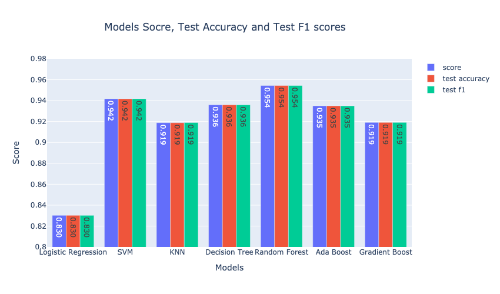

### Unlocking Airline Passenger Satisfaction: Key Factors for Enhanced Experience

**Author** 
Ben Harosh

### Executive summary

This capstone project delves into Machine Learning techniques aimed at classifying the satisfaction levels of airline passengers, determining whether customers will be satisfied or dissatisfied. The dataset for this task encompasses three types of features:

* Numerical data, including customer age and distance flown.
* Categorical data, such as customer loyalty, class of travel, and type of travel.
* Customer survey data, comprising ratings provided by customers on the booking process, pre-flight, and in-flight services.

The project aims to discern which features contribute to customer satisfaction and which may lead to dissatisfaction. By thoroughly analyzing the dataset, I will construct a predictive model capable of accurately predicting whether a given customer will be satisfied or dissatisfied with the airline service. Subsequently, I will conduct an in-depth analysis to identify the features that have the greatest impact on customer satisfaction. Based on this analysis, recommendations will be provided to the airline on areas (features) to prioritize in order to enhance customer satisfaction. Identifying these features holds significant importance for the airline, as it can aid in customer retention, expansion of the customer base, and ultimately, revenue growth.

### Rationale
In the competitive landscape of the airline industry, customer satisfaction is a key for customer happiness and retention. Identifying features that can contribute to increasing customer satisfaction, can be crucial to airlines in terms of keeping existing customers, expanding customer base and increasing revenue as a consequence

### Research Question
Find the factors that contribute to airline customer satisfaction and tailor their services accordingly to enhance the overall customer experience

### Data Sources
Kaggle data source “Airline Customer Satisfaction” 
https://www.kaggle.com/datasets/raminhuseyn/airline-customer-satisfaction/data

### Data Description
The dataset comprises 129,880 records, with a small number (~300) of missing values. It includes 21 features, encompassing the target variable `satisfaction`. Seven features were collected by the airline, such as customer age, flight distance, arrival and departure delays (numerical), as well as customer type, type of travel, and class of travel (categorical features). The remaining 13 features consist of customer survey data, covering the customer ratings of the flight booking process, support services, ground services, pre-flight and in-flight services.

A full feature list can be found [here](./FEATURES.md)

### Methodology
Exploratory Data Analysis:
* Data perp, cleaning nulls and duplicates check
* Analyzing the distribution of the target class
* Exploring numerical features: their distribution, outliers analysis and correlation matrix
* Exploring categorical features: their distribution, their breakdown vs the target variable 
* Exploring customer survey features: their distribution, their breakdown vs the target variable
* Exploring disloyal customers' survey features

Classification Methods Used:
* Neural Networks
* Binary Random Forest Classifier
* Binary LogisticRegression Classifier
* Binary SVM Classifier
* Binary KNeighbors Classifier
* Binary DecisionTree Classifier
* Binary AdaBoost Classifier
* Binary DecisionTree Classifier
* Binary GradientBoosting Classifier

### Summary of Findings

#### Data characteristics:
* The dataset seemed to be slanted towards loyal customers - survey boasted over four times loyal customers (`81.69%`) than disloyal ones (`18.31%`)
* The dataset had customers who were on business travel more than double the number of those who were on personal travel
* The dataset maintained a balanced representation between economy (`44.84%`) and business class (`47.92%`) passengers. However, only `7.23%` of the airline passengers in the data set were flying economy plus
* Dataset was heavily focused on customers who taken short to mid range flights with most of the data collected from customers who traveled less than 4000 miles, where most of them(`67.42%`) flew 1000-3000 miles

#### Findings
* Air travelers who flew mid-range flights (1000-3000 miles) exhibited heightened levels of dissatisfaction compared to those on shorter or longer flights
* Departure and arrival delays exceeding 20 minutes were found to correlate with increased dissatisfaction levels, contrasting with shorter delays. There was almost no dissatisfaction difference between departure and arrival delays, which seems readonable since those are metrics that are highly correlated to begin with   
* Loyal customers demonstrated significantly higher satisfaction rates compared to disloyal air passengers, highlighting the importance of customer loyalty
* Customers flying Business Class reported a higher satisfaction rate 71%, surpassing the aggregated satisfaction average (55%)
* Customers traveling for personal reasons exhibited a lower satisfaction rate of 48% compared to the aggregated satisfaction average (55%)
* Disloyal customers reported a significantly lower satisfaction rate of 24% compared to the overall satisfaction average (55%)
* Seat comfort and In-flight Entertainment as the most influential features contributing to satisfaction
* Although rated high by many customers, cleanliness did not emerge as a significant factor to determine satisfaction 
* Customers on personal travel were found had higher satisfaction rates
Ease of pre-flight service as online booking and customer support played a role in enhancing customer satisfaction

#### Recommendations
  - Gather more data on disloyal customers in the future, in order to understand better the reason for their high diasstisfaction rate
  - Understand how to improve the experience of disloyal customers, maybe in ways of personal promotions and provide them with more features that contributed to higher satisfaction - as in-flight entertainment, in-flight food and drink and making sure that their pre-flight experience is positive (baggage handling and checkin services) 
  - Improve seat comfort as a way to increase customer satisfaction. Dat ahs shown that even customers who ranked it mediocore (3 out of 5) - had 2 times dissatisfaction rate compated to the overall rate
  - Enhance entertainment and WiFi services during flight as those contributed to overall higher satisfaction rates from customers who enjoyed them. I also noticed higher disatisfaction rate from customers who ranked their experience as mediocore negative with those services
  - Expand pre-flight online booking and support and solidify ground services (checkin and baggage handling) as a way to keep and increase satisfaction rates
  - Remove one out of the two customer survey questions regarding departure and arrival delay in minutes, since the answers on these were highly correlated (over 90%), which seems reasonale since both metrics are highly correlated to begin with
  

### Detailed Explanation of Results
#### Modeling
##### Basic classification modeling
Since the satisfaction and dissatisfaction classes are fairly balanced, and since I don't place significant emphasis on misclassification (recall or precision), but rather prioritize achieving accurate classification, I will focus on the accuracy metric for comparing the different classification models. With that in mind, the best classifier boasting the highest test classification accuracy is the RandomForestClassifier, achieving an accuracy of 95.60%. Following closely in second place is SVM with a test accuracy of 94.1%.

##### GridSearchCV with leading classification models
I focused on the 4 top performing models from basic classification phase and ran GridSearchCV with different grid parameters in order to fine-tune the model training phase. Here are the results:

The best classifier boasting the highest test classification accuracy was again the RandomForestClassifier with a slighly improved accuracy of `95.66%` 
##### Neural Network modeling
I constructed and trained two distinct types of neural networks to improve classification results. Initially, I developed a simple network comprising a single layer of hidden units (`NN_Simple` in the chart), followed by a more complex network featuring three layers of hidden units with added regularization (`NN_Complex` in the chart). Subsequently, I conducted a GridSearchCV to fine-tune the parameters of the more complex network (`NN_GridSearchCV` in the chart). Here are the outcomes:

I observed a significant enhancement in the test accuracy of the more complex neural network model, achieving accuracy of `95.83%` (with a peak of `95.90%` during training on the test set). Both the more complex neural network model and its fine-tuned counterpart via `GridSearchCV` showcased superior performance compared to other classification models, albeit not by substantial margins. It's worth noting that due to limitations in computational resources, I could only execute a partial version of the grid parameters I had planned to test. Consequently, further fine-tuning with additional grid parameters is expected to yield even greater improvements in the accuracy of the best model.

#### Feature Importance
I employed two distinct methods to extract the most important features from the trained models. Through our analysis, I identified the following features as playing the most significant role in this classification problem:
* Seat Comfort
* Inflight Entrtainment
* Ease of Online Booking
* On-Board Service
* Online Support
* Checkin Service

#### Next steps
* Follow up on the mentioned recommendations 
* Improve the Neural Network model and fine-tune it to have higher accuracy of predicting satisfaction
* Explore the `shap` library to better understand feature importance, alongsode the other feature importance methods I used above

### Outline of project
- [Link to capstone notebook](https://github.com/benharosh/berkeley_capstone/blob/master/capstone-final.ipynb)
- [Link to capstone notebook on GitHub Dev](https://github.dev/benharosh/berkeley_capstone/blob/master/capstone-final.ipynb)

#### Contact and Further Information
`benharosh@gmail.com`